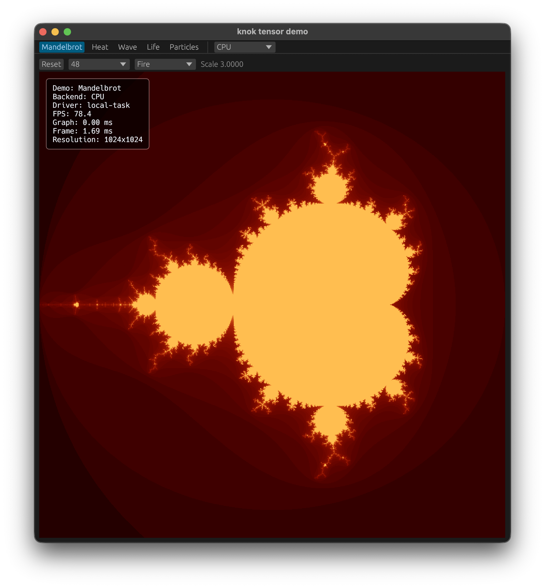
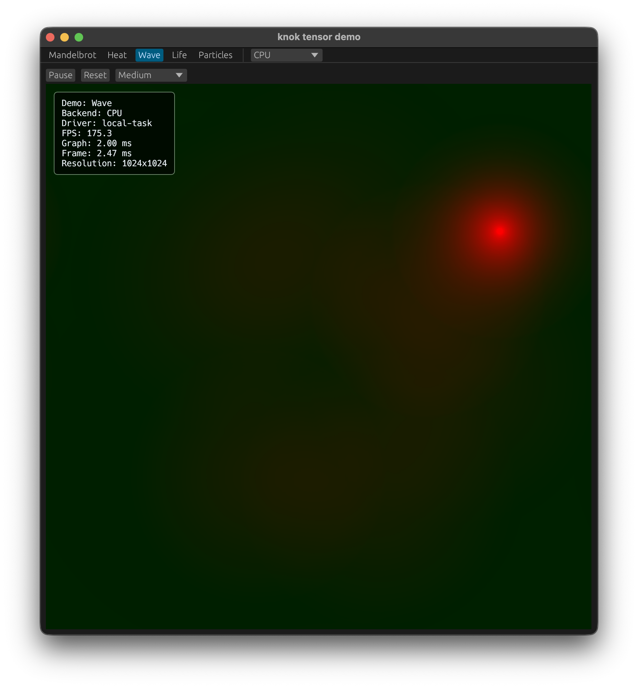
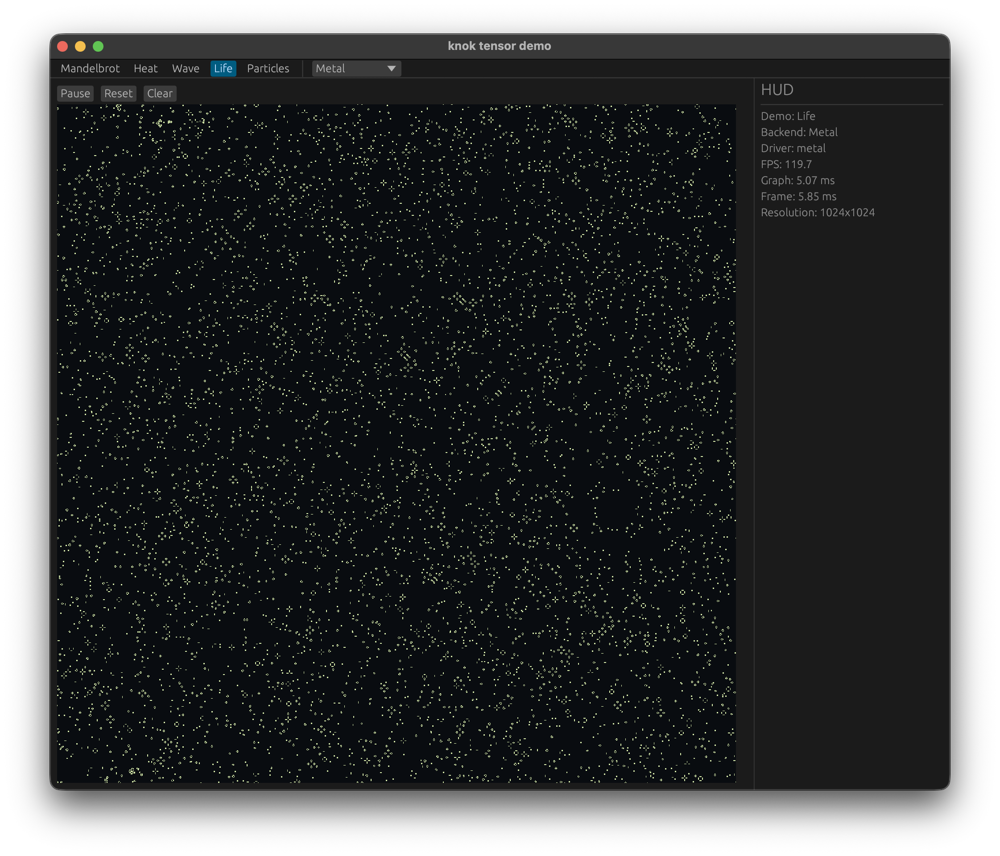
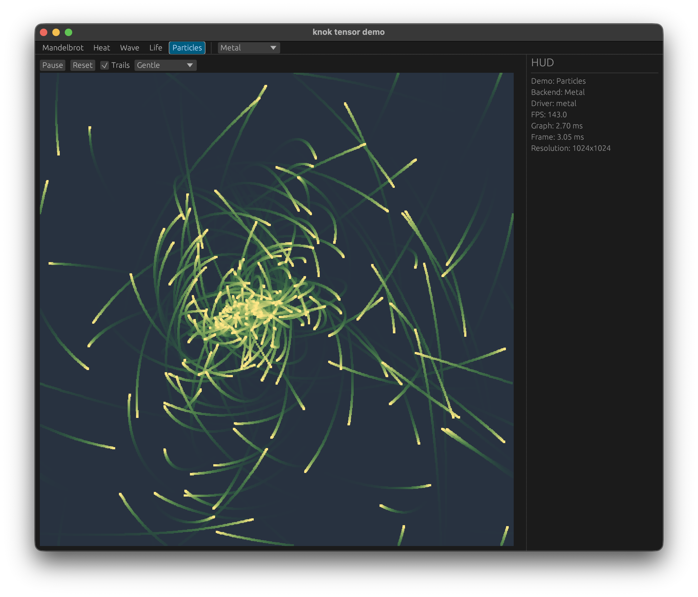

# knok Demo

Interactive `egui` demo for static [`knok`](https://github.com/gmmyung/knok) tensor graphs.

## Run

From a shell with the [`knok`](https://github.com/gmmyung/knok) build dependencies available:

```sh
cargo run
```

The app builds `1024x1024` fixed-shape graph variants for:

- Mandelbrot
- Heat diffusion
- Wave simulation
- Conway's Game of Life
- Particle interaction

## Screenshots

| Mandelbrot | Wave |
| --- | --- |
|  |  |

| Life | Particles |
| --- | --- |
|  |  |

The `knok CPU` and `Ndarray CPU` backends are enabled by default. `knok CPU` runs the compiled `knok` graph backend, while `Ndarray CPU` is a plain Rust CPU baseline for comparison. The HUD compute time includes the app's tensor/array conversion path. Optional backend builds:

```sh
cargo run --features vulkan
cargo run --features cuda
```

On macOS, Metal graph variants are compiled by target `cfg`.
